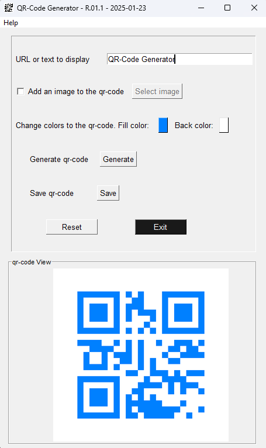

## QR-Code-Generator

<!-- PROJECT LOGO -->
 

    
<h3 align="center">Generate your QR-Code and customize it</h3>

 

    

There are two versions: 
- With a user interface (see the file qrcode_with_logo_UI.py)
- Simple code (see the file qrcode_with_logo_R01.py)

## :wrench: Dependencies and Installation

- Python >= 3.9.21 (Recommend to use [Anaconda](https://www.anaconda.com/download/#linux) or [Miniconda](https://docs.conda.io/en/latest/miniconda.html))

### :computer: Requirements

- qrcode >= 8.0
- pillow
- PySimpleGUI >= 4.70.1

<!-- CONTACT -->
## 🌐 Contact

  
  
  
  
  

 

<!-- Stats -->
## 🔥 My Stats

  

  

## :scroll: License
Copyright (C) 2025 Marco Intelisano

This program is free software: you can redistribute it and/or modify it under the terms of the GNU General Public License as published by the Free Software Foundation, either version 3 of the License, or any later version.

This program is distributed in the hope that it will be useful, but WITHOUT ANY WARRANTY; without even the implied warranty of MERCHANTABILITY or FITNESS FOR A PARTICULAR PURPOSE. See the GNU General Public License for more details.

You should have received a copy of the GNU General Public License along with this program. If not, see https://www.gnu.org/licenses/.
